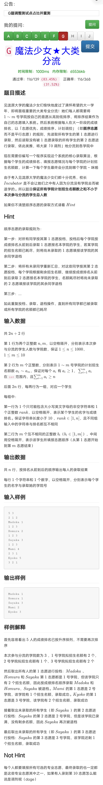

#### 任务描述

给定一个尺寸为m x n（m和n均不超过100）的网格状矩形地图，每个网格（i, j）的边长为1，并且有一个高度h，h为0代表平原，h > 0代表山峰。请你设计C/C++程序，计算山峰轮廓的周长总和，即与平原邻接部分的周长（不包含山峰之间的重叠部分；假设地图之外均为平原）。

#### 输入格式

第一行，两个正整数m和n（代表二维矩阵的行和列）
第2~m+1行，每行n个整数（代表每个网格的高度 0 <= h < 10）

#### 输出格式

一行，一个正整数（代表整个地图中所有山峰的周长之和）

#### 样例1

输入：
`1` `1`
`2`
预期输出：
`4`

#### 样例2

输入：
`4` `4`
`0` `1` `0` `0`
`5` `8` `3` `0`
`0` `9` `0` `0`
`0` `0` `4` `1`
预期输出：
`18`
解释：地图中由1、5、8、3、9构成的山峰轮廓周长为12。由4、1构成的山峰轮廓周长为6。轮廓周长总和为 12 + 6 = 18。

#### 任务描述

请你设计C/C++程序，根据输入的整数n (1<=n<=7)，按照样例所示规律 用星号输出对应的递归三角形图案。

#### 输入格式

一行，1个正整数n (1<=n<=7)

#### 输出格式

2^(n-1)行（n对应的递归三角形图案。注意：为了美观，同行相邻的两个星号之间用空格分隔。）

#### 样例1

输入：`1`
预期输出：

#### 样例2

输入：`2`
预期输出：

#### 样例3

输入：`3`
预期输出： 

#### 样例4

输入：`4`
预期输出： 

#### 任务描述

朋友的朋友也是朋友，朋友的朋友的朋友…也是朋友，自己和自己也是朋友。你和你所有的直接朋友及间接朋友构成一个朋友圈。给定nxn的矩阵f，如果f[i][j]=1，则第i+1个人和第j+1个人是直接朋友，如果f[i][j]=0，则他们不是直接朋友。请你设计C/C++程序，推断间接朋友关系，并输出f对应的朋友圈数量。

#### 输入格式（n+1行）

第一行，一个正整数n（代表人数，n不超过100）
第2~n+1行，每行n个整数（只有0和1两种取值，代表矩阵f）

#### 输出格式

一行，一个正整数（代表朋友圈数量）

#### 样例

输入：
`5`
`1` `1` `0` `0` `0`
`1` `1` `1` `0` `0`
`0` `1` `1` `0` `0`
`0` `0` `0` `1` `1`
`0` `0` `0` `1` `1`

0 1 0 0 0
    1 0 0
      0 0
        1

2-1
3-2
5-4

预期输出：
`2`
解释：第1个人和第2个人是直接朋友，第2个人和第3个人也是直接朋友，于是第1个人和第3个人是间接朋友，他们仨形成一个朋友圈；第4个人和第5个人是直接朋友，他们俩和前三个人都不是直接朋友，于是形成另一个朋友圈。

