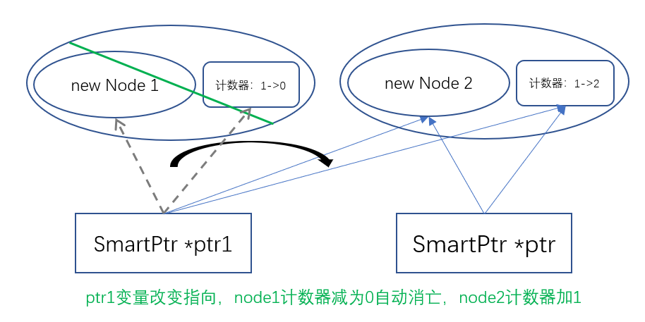

任务描述
智能指针是C++标准库提供的一种机制，用于防止内存泄漏，及时回收不再需要的内存。
当我们使用普通的指针变量时，一旦程序变得冗长复杂，难免会出现忘记释放内存的情况，导致可用的内存变少。

如果使用智能指针，那么智能指针内部会维护一个指针指向目标地址，和一个相关联的计数器指针（他们在内存上的地址并无关联，只有逻辑上的联系）。计数器统计持有目标地址的指针数量，一旦计数器为0，那么就可以认为没有任何指针可以访问到该地址，该地址将不再被需要，此时，就可以释放内存。
 
这样，我们就不需要关心内存的释放，而由智能指针选择在合适的时机释放内存。
本关要求你补全一个伪智能指针类SmartPointer，为了简单起见，本关中该智能指针类只能指向动态分配内存的Node类型的对象，并且一个Node对象地址只会用于初始化一个智能指针（Node类型是我们定义的占位类型，一个Node对象表示一块需要SmartPointer管理的空间）。
它在指针类内部维护两个关键成员变量：
         Node* pointer;
         int* ref_cnt;
        Node类型的指针变量pointer。
        一个指向整型变量的指针ref_cnt，它指向的值*ref_cnt表示当前拥有pointer所指向的Node对象地址的SmartPointer对象数。
该指针类有三个需要你完成的成员函数：
        拷贝构造函数，使用一个SmartPointer对象来初始化本对象。
        assign函数，该函数接收一个SmartPointer对象sptr，并将本对象的pointer指针赋值为sptr.pointer。
        析构函数，销毁本SmartPoiner对象，也就是说，本对象不再持有pointer指针指向的Node地址。注意：为通过测试样例，需要保证析构函数可以被重复调用。
你需要在实现的过程中，维护两个成员变量的值，你可能需要思考在上述操作中，ref_cnt应该如何赋值和改变，使得对于任何Node对象，如果没有SmartPointer对象持有其地址，则其持有的空间被释放(即在*ref_cnt为0的时候释放pointer指向的Node对象)。
输出
测评文件将会根据Node类对象析构输出对应的id的顺序来判断程序是否正确，所以请尽量不要修改头文件内容。
样例1
        SmartPointer sp1(new Node(1));
        //函数结束，此时node1应该被销毁
输出：
1
样例2
        SmartPointer sp1(new Node(1));
        SmartPointer* sp2=new SmartPointer(sp1);
        //函数结束，sp1被销毁，此时sp2仍持有node1的地址，node1不被销毁
输出：

样例3
        SmartPointer sp1(new Node(123));
        sp1.~SmartPointer();
        sp1.assign(SmartPointer());//测试空指针赋值
        sp1.assign(*(new SmartPointer(new Node(456))));//Node 456仍然被堆空间中的某个指针持有，所以不会被释放
输出
123
提示
        请注意代码的鲁棒性，如果存在能导致程序崩溃的代码，那么就可能不通过测试样例，所以请仔细思考特例条件，尤其是各种可能出现空指针的情况。
        请不要在代码文件中包含"shared_ptr"字段，我们将在测评时进行检测。
